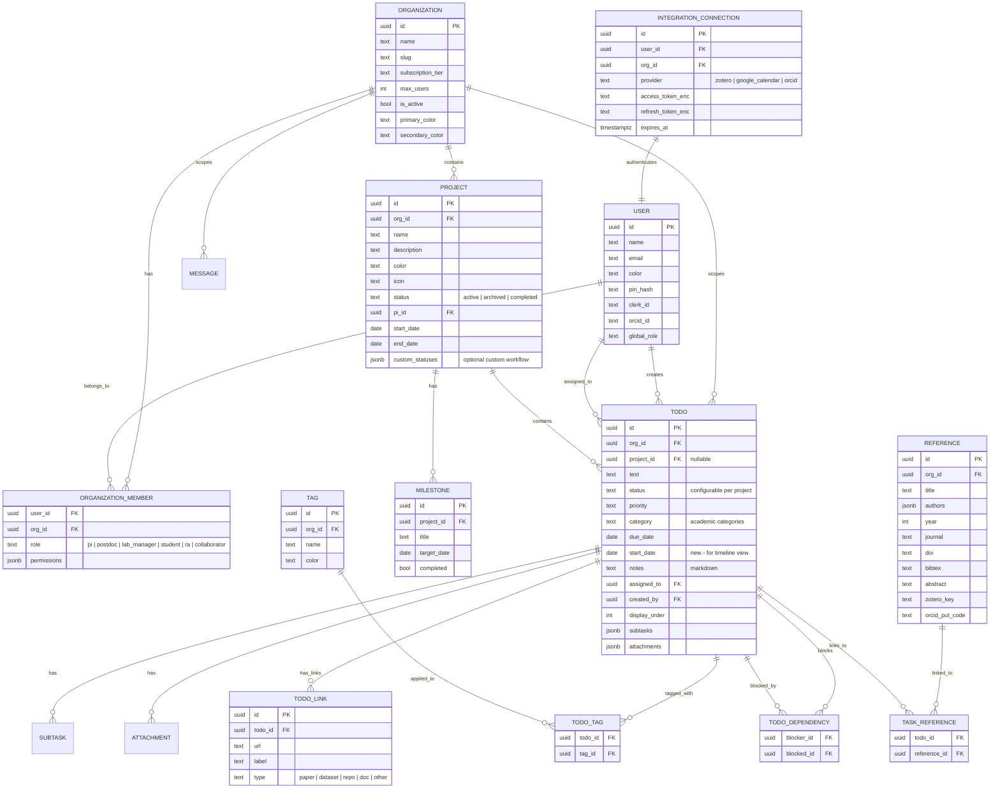

# Academic Research Task Management: Adaptation Plan

> **Collaborative analysis by four specialized agents examining the `shared-todo-list` codebase for adaptation to academic research workflows.**

---

## 1. Executive Summary

**Vision**: Transform a production-grade, multi-tenant insurance agency task management platform into a research lab operations tool purpose-built for academic researchers — from solo PhD students to multi-PI collaborative labs.

**Why this codebase?** The shared-todo-list app has a mature foundation that would take 12+ months to rebuild from scratch:
- Real-time collaboration (presence, typing indicators, live sync)
- 21-permission RBAC with multi-tenant isolation via Supabase RLS
- Kanban, calendar (day/week/month), and list views with drag-and-drop
- AI-powered task creation (Claude + Whisper transcription)
- Offline-first PWA with IndexedDB sync queue
- Full dark mode, keyboard shortcuts, command palette (Cmd+K)
- iOS companion app with shared backend

**Key differentiators vs. existing academic tools:**

| Tool | Limitation for Researchers | Our Advantage |
|------|---------------------------|---------------|
| **Notion** | No real-time presence, no granular permissions, no offline-first | Built-in real-time collaboration, 21 permissions, PWA offline |
| **Trello** | No calendar views, no AI features, limited task depth | Day/week/month calendar, AI smart-parse, subtasks + attachments |
| **ClickUp** | Overwhelming complexity, expensive for labs | Academic-focused simplicity, self-hostable on Supabase |
| **Todoist** | No multi-user workspace, no kanban | Full multi-tenant team support, kanban + calendar + list views |
| **Asana** | No offline, no field-level encryption, expensive | PWA offline for fieldwork, encrypted PII, free tier possible |

**Estimated effort**: ~60% of the codebase is generic and reusable. ~40% is insurance-specific and needs replacement or removal. The core infrastructure (auth, permissions, real-time, views, AI) transfers directly.

[Architect] [Domain Expert] [UX Specialist] [Integration Engineer]

---

## 2. Current Repo Assessment

### 2.1 Tech Stack Inventory

| Layer | Technology | Version | Health |
|-------|-----------|---------|--------|
| Framework | Next.js (App Router) | 16.0.10 | Current |
| UI | React | 19.2.4 | Current |
| Types | TypeScript | 5.9.3 | Strict mode |
| Styling | Tailwind CSS v4 | 4.x | Current (PostCSS plugin) |
| Database | Supabase (Postgres + RLS) | 2.86.2 | Production-ready |
| State | Zustand | 5.0.9 | Current |
| Data Fetching | React Query v5 | 5.90.20 | Current |
| Animation | Framer Motion | 12.23.25 | Used in 157 files |
| Drag & Drop | @dnd-kit | 6.3.1 / 8.0.0 | Used in kanban + calendar |
| AI | Anthropic SDK | 0.71.2 | Claude claude-sonnet-4-20250514 |
| Auth | Clerk (SSO/SAML) | 6.37.2 | Recommended path |
| Icons | Lucide React | 0.556.0 | 200+ icons |
| Charts | Recharts | 3.7.0 | Dashboard visualizations |
| Testing | Vitest + Playwright | 4.0.16 / 1.57.0 | 109 E2E specs |
| Monitoring | Sentry | 10.32.1 | Optional |
| Email | Resend | 6.9.1 | Transactional |
| Rate Limiting | Upstash Redis | 1.36.1 | 5 tiers configured |
| PWA | next-pwa + workbox | 5.6.0 / 7.4.0 | Offline-ready |

**Also present (legacy):** SWR (superseded by React Query), NextAuth (superseded by Clerk)

[Architect]

### 2.2 What Works Well and Should Be Preserved

1. **Permission system** — 21 granular permissions across 4 categories (tasks, team, chat, features) with role defaults, custom overrides, and presets. Maps naturally to PI/Postdoc/Student/RA roles. [Architect]

2. **Multi-tenancy architecture** — Agency-scoped RLS policies, agency switching, membership management. "Agency" becomes "Research Lab" with zero structural changes. [Architect] [Integration Engineer]

3. **Real-time collaboration** — Three-channel approach (messages, typing indicators, presence) with proper cleanup, throttling, and reconnection handling. Essential for distributed research teams. [Architect]

4. **View system** — List, Kanban, Calendar (day/week/month), Dashboard with animated transitions via Framer Motion. All views are generic task renderers that work with any domain. [UX Specialist]

5. **AI features** — 12 Claude-powered endpoints for smart parsing, task breakdown, email generation, transcription. Only the NLP context strings are insurance-specific; the pipeline is generic. [Integration Engineer]

6. **Keyboard-first UX** — Command palette (Cmd+K), 20+ keyboard shortcuts across views, roving tabindex in task lists, focus mode. Power users (researchers) will love this. [UX Specialist]

7. **Accessibility** — Skip links, focus traps, ARIA attributes, reduced-motion support, WCAG AA contrast ratios, screen reader live regions. [UX Specialist]

8. **Offline-first PWA** — IndexedDB sync queue with retry logic, service worker caching. Critical for fieldwork in remote locations. [Integration Engineer]

9. **Security posture** — CSP headers, CSRF split-token, rate limiting (5 tiers), field-level AES-256-GCM encryption, timing-safe comparisons, security event monitoring. [Integration Engineer]

10. **Auth wrappers** — Composable `withAgencyAuth`, `withSessionAuth`, `withAiAuth`, `withSystemAuth` pattern for clean route protection. [Architect]

### 2.3 What Needs Reworking

#### HIGH Priority — Deep Insurance Coupling

| What | Files | Action |
|------|-------|--------|
| Todo model insurance fields | `src/types/todo.ts` (lines 117-124) | Remove `premium_amount`, `policy_type`, `renewal_status`, `customer_segment`, `customer_id`, `customer_name`; add `project_id`, `tags`, `links` |
| Task categories | `src/types/todo.ts` (lines 20, 661-672) | Replace `'quote'\|'renewal'\|'claim'` with configurable academic categories |
| Customer subsystem | `src/types/customer.ts`, `src/types/allstate-analytics.ts` (838 lines), 3 API routes, 8 components | Remove entirely |
| Analytics modules | 12+ files in `src/lib/` (allstate-parser, segmentation, lead-scoring, loss-ratio, cash-flow, etc.) | Remove or replace with academic analytics |
| Analytics API routes | 8 routes under `/api/analytics/` | Replace with academic endpoints |
| Opportunity routes | 4 routes under `/api/opportunities/` | Remove |
| Insurance dashboards | `BookOfBusinessDashboard`, `PipelineHealthPanel`, `RenewalsCalendarPanel`, `TeamProductionPanel` | Replace with research dashboards |
| Outlook integration | 3 API routes + `outlookAuth.ts` | Remove |
| Insurance reference data | `src/data/bealer-model/` (7 subdirs), `src/reference/` | Remove |
| Quick task templates | `INSURANCE_QUICK_TASKS` in `src/types/todo.ts` (lines 725-862) | Replace with academic templates |

[Architect] [Domain Expert]

#### MEDIUM Priority — Branding and Naming

| What | Location | Action |
|------|----------|--------|
| App title | `layout.tsx`: "Bealer Agency - Task Management" | Rename |
| Tagline | "You're in good hands with our task management system" (Allstate tagline) | Replace |
| Theme color | `#0033A0` (Allstate blue) | Replace with academic palette |
| localStorage keys | `bealer-current-agency`, `bealer-theme`, etc. | Rename |
| PWA title | "BA Tasks" | Rename |
| Email sender | "Bealer Agency <noreply@bealertodo.com>" | Replace |
| Clerk comments | "federated SSO with Allstate" | Update |

[UX Specialist]

#### LOW Priority — Technical Cleanup

- Remove SWR (superseded by React Query) [Architect]
- Remove NextAuth + Supabase adapter (superseded by Clerk) [Architect]
- Remove `.mcp.json` plaintext API key from version control [Integration Engineer]
- Rewrite insurance-specific Playwright tests (~40% of 109 specs) [Architect]

---

## 3. Proposed Feature Set

### P0 — Core (MVP for Academic Use)

#### P0.1: Projects (Task Grouping)
- **Description**: Add a `Project` entity as a first-class concept. Every task optionally belongs to a project. Projects have: name, description, color, icon, status (active/archived/completed), PI (owner), start/end dates. Replaces the flat task list with hierarchical organization.
- **User story**: "As a PhD student, I want to create a 'Thesis' project and group my tasks under chapters, so my task list is organized by thesis structure."
- **Complexity**: Medium (new table, FK on todos, filter/sidebar changes)
- **Consensus**: All 4 agents agree this is the #1 gap. [Architect] [Domain Expert] [UX Specialist] [Integration Engineer]

#### P0.2: Tags/Labels
- **Description**: Many-to-many tag system for cross-cutting concerns. Tags are color-coded, user-created, and filterable. Examples: "Fieldwork", "Mo'orea", "NSF-2345", "Chapter 3".
- **User story**: "As a postdoc managing three papers simultaneously, I want to tag tasks with paper names (#coral-resilience, #reef-fish-behavior) and filter by tag."
- **Complexity**: Low-Medium (junction table, filter bar extension)
- **Consensus**: All agents agree. [Architect] [Domain Expert] [UX Specialist]

#### P0.3: Academic Task Categories
- **Description**: Replace hardcoded insurance categories with configurable academic defaults: `experiment`, `manuscript`, `grant_writing`, `literature_review`, `teaching`, `fieldwork`, `meeting`, `analysis`, `administrative`, `other`.
- **User story**: "As a researcher, I want task categories relevant to my work instead of insurance categories."
- **Complexity**: Low (type changes + seed data, UI already renders from type)
- **Consensus**: All agents agree. [Architect] [Domain Expert]

#### P0.4: Reference Links Field
- **Description**: Add a `links` array to the Todo model: `{ url: string, label: string, type: 'paper' | 'dataset' | 'repo' | 'doc' | 'other' }`. Enables linking tasks to DOIs, Google Docs, GitHub repos.
- **User story**: "As a researcher, I want to add a DOI link and Google Doc link to a 'Revise Discussion section' task."
- **Complexity**: Low (JSONB field, small UI addition)
- **Consensus**: Domain Expert + Integration Engineer strongly advocate. [Domain Expert] [Integration Engineer]

#### P0.5: Data Export
- **Description**: `GET /api/todos/export?format=csv|json` endpoint. Currently **no export functionality exists**. This is critical for data portability and compliance.
- **User story**: "As a researcher, I want to export all my tasks as CSV for reporting to my department."
- **Complexity**: Low (wraps existing TodoService with streaming response)
- **Consensus**: Integration Engineer flags this as a critical gap. [Integration Engineer] [Architect]

#### P0.6: Remove Insurance Domain
- **Description**: Strip all Allstate-specific code (types, parsers, analytics, dashboards, API routes, branding). This is prerequisite work, not a feature, but must happen for MVP.
- **Complexity**: Medium-High (40% of codebase, but mostly removal not creation)
- **Consensus**: All agents agree this must happen early. [All]

### P1 — Important (First Post-Launch Iteration)

#### P1.1: Task Dependencies
- **Description**: `blocked_by` and `blocks` arrays on the Todo model. Display dependency chains in calendar and kanban views. Critical for experiment pipelines.
- **User story**: "As a PhD student, I want to mark 'Write Methods' is blocked by 'Complete statistical analysis', so the app shows which tasks I can work on now."
- **Complexity**: Medium (new relations, UI indicators, topological sort for display)
- **Consensus**: Domain Expert + Architect strongly advocate. UX Specialist notes Gantt view depends on this. [Domain Expert] [Architect]

#### P1.2: Custom Status Workflows
- **Description**: Allow per-project custom status columns beyond todo/in_progress/done. The kanban infrastructure already supports columns — this makes them configurable. Example: Draft → Internal Review → Submitted → Revisions → Accepted → Published.
- **User story**: "As a postdoc, I want a manuscript kanban board with stages from Draft to Published."
- **Complexity**: Medium (schema for custom statuses, kanban column config)
- **Consensus**: Domain Expert proposes, Architect confirms kanban infra supports it. [Domain Expert] [Architect]

#### P1.3: Manuscript Pipeline View
- **Description**: Dedicated view showing all manuscripts as cards progressing through publication stages. Links to projects and associated tasks. Replaces insurance pipeline dashboard.
- **User story**: "As a PI, I want a birds-eye view of all lab manuscripts at their current publication stage."
- **Complexity**: Medium (new view component, reuses existing StatCard/pipeline UI)
- **Consensus**: Domain Expert + UX Specialist co-propose. [Domain Expert] [UX Specialist]

#### P1.4: Academic Roles
- **Description**: Remap the 3-role system: owner → PI, manager → Postdoc/Lab Manager, staff → PhD Student/Undergrad RA. Add "Collaborator" role (view-only, cross-lab).
- **User story**: "As a PI, I want my postdoc to manage tasks while PhD students only see their own assignments."
- **Complexity**: Low (role label mapping + Collaborator role using existing `view_only` preset)
- **Consensus**: All agents agree. [Domain Expert] [Architect]

#### P1.5: Markdown Notes Editor
- **Description**: Replace plain `<textarea>` in NotesSection with a markdown editor (edit/preview toggle). Researchers write notes with citations, lists, and formatting.
- **User story**: "As a researcher, I want to write task notes in Markdown with headings, links, and code blocks."
- **Complexity**: Low-Medium (add react-markdown or Tiptap, preserve onBlur save pattern)
- **Consensus**: UX Specialist proposes, Domain Expert endorses. [UX Specialist] [Domain Expert]

#### P1.6: Google Calendar Sync
- **Description**: Two-way sync between task due dates and Google Calendar events. Clerk already supports Google OAuth — extend with calendar scope.
- **User story**: "As a researcher, I want my task deadlines to appear on my Google Calendar automatically."
- **Complexity**: Medium (OAuth scope extension, webhook handler, sync logic)
- **Consensus**: Integration Engineer designs, Architect validates feasibility. [Integration Engineer] [Architect]

#### P1.7: Progress Dashboards per Project
- **Description**: Per-project completion rates, burndown charts, and milestone tracking. Reuses existing dashboard infrastructure (StatCard, MiniSparkline, ProgressRing).
- **User story**: "As a PI, I want to see how each research project is progressing toward its milestones."
- **Complexity**: Medium (new dashboard variant, project-filtered queries)
- **Consensus**: UX Specialist + Domain Expert co-propose. [UX Specialist] [Domain Expert]

### P2 — Nice-to-Have (Future Roadmap)

#### P2.1: Zotero/Mendeley Integration -- COMPLETE
- **Description**: Import references via Zotero Web API. Link reading tasks to papers. Track read/annotated/cited status.
- **User story**: "As a PhD student, I want to import my Zotero library and create reading tasks linked to each paper."
- **Complexity**: High (new `references` table, OAuth flow, bidirectional sync)
- **Consensus**: Domain Expert + Integration Engineer strongly advocate. [Domain Expert] [Integration Engineer]

#### P2.2: Gantt/Timeline View -- COMPLETE
- **Description**: Horizontal timeline showing tasks as bars from start_date to due_date, grouped by project. Requires task dependencies (P1.1) and start_date field.
- **User story**: "As a PI, I want to see my research projects on a timeline to plan field seasons and grant cycles."
- **Complexity**: High (new view component, start_date field, dependency rendering)
- **Consensus**: UX Specialist proposes, Architect notes dependency on P1.1. [UX Specialist] [Architect]

#### P2.3: Experiment Log Templates -- COMPLETE
- **Description**: Structured forms for logging experiments: date, protocol, equipment, conditions, results, photos. Builds on existing template and attachment systems.
- **User story**: "As a field researcher, I want to fill out a structured experiment log when completing a fieldwork task."
- **Complexity**: Medium (form builder UI, template schema extension)
- **Consensus**: Domain Expert proposes for lab-team use. [Domain Expert]

#### P2.4: AI Retuned for Academia -- COMPLETE
- **Description**: Re-prompt AI smart-parse and AI Inbox for academic contexts: extracting action items from advisor emails, parsing CFPs into deadline tasks, breaking grant RFPs into proposal sections.
- **User story**: "As a researcher, I want the AI to parse a conference Call for Papers and create deadline tasks automatically."
- **Complexity**: Low (prompt engineering, no architecture changes)
- **Consensus**: All agents agree this is high-value/low-effort. [Domain Expert] [Integration Engineer]

#### P2.5: ORCID Integration -- FUTURE/BACKLOG
- **Description**: Import publication lists from ORCID. Auto-generate tasks for new publications (review proof, update CV).
- **Complexity**: Medium (OAuth, one-way sync)
- **Consensus**: Integration Engineer proposes. [Integration Engineer]

#### P2.6: Lab Equipment Calendar -- FUTURE/BACKLOG
- **Description**: Resource-booking calendar for shared equipment (microscopes, boats, dive gear). Separate from task calendar.
- **Complexity**: High (new data model, conflict detection, approval workflow)
- **Consensus**: Domain Expert proposes for lab manager persona. [Domain Expert]

#### P2.7: Grant Budget Tracking -- COMPLETE
- **Description**: Replace insurance financial fields with grant budget tracking: total award, spend by category, burn rate, remaining balance.
- **Complexity**: Medium (new data model, dashboard panel)
- **Consensus**: Domain Expert proposes for PI persona. [Domain Expert]

#### P2.8: Institutional SSO (SAML) -- FUTURE/BACKLOG
- **Description**: Clerk already supports SAML 2.0 and OIDC. UCSB uses Shibboleth. Configuration-only, no code changes needed.
- **Complexity**: Low (Clerk dashboard configuration)
- **Consensus**: Integration Engineer confirms zero code changes. [Integration Engineer]

---

## 4. Architecture Proposal

### 4.1 Updated Data Model



[Architect] [Integration Engineer]

### 4.2 Terminology Mapping

| Insurance Term | Academic Term | Code Change |
|---------------|--------------|-------------|
| Agency | Organization / Lab | Rename type + context |
| Agency Member | Lab Member | Rename |
| Owner | PI (Principal Investigator) | Role label |
| Manager | Postdoc / Lab Manager | Role label |
| Staff | PhD Student / Undergrad RA | Role label |
| Customer | Collaborator | Replace entity |
| Quote/Renewal/Claim | Experiment/Manuscript/Grant | Category values |
| Premium Amount | Grant Budget | Field replacement |
| Policy Type | Project Type | Field replacement |
| Cross-sell Opportunity | Research Opportunity | Remove |
| Allstate Agency Code | (removed) | Drop field |

[Architect] [Domain Expert]

### 4.3 New API Routes Needed

```
# Projects
GET    /api/projects                    — List projects for current org
POST   /api/projects                    — Create project
PUT    /api/projects/[id]               — Update project
DELETE /api/projects/[id]               — Archive project

# Tags
GET    /api/tags                        — List tags for current org
POST   /api/tags                        — Create tag
DELETE /api/tags/[id]                   — Delete tag

# Export
GET    /api/todos/export?format=csv|json — Export tasks
GET    /api/org/export                   — Full org data dump (backup)

# References (P2)
GET    /api/references                  — List references
POST   /api/references                  — Create reference
POST   /api/references/import-bibtex    — Import BibTeX file

# Integrations (P1-P2)
POST   /api/integrations/[provider]/connect    — OAuth handshake
GET    /api/integrations/[provider]/status      — Connection status
POST   /api/integrations/[provider]/sync        — Trigger sync
DELETE /api/integrations/[provider]/disconnect   — Remove connection
POST   /api/webhooks/gcal                       — Google Calendar push notifications
```

[Architect] [Integration Engineer]

### 4.4 State Management Changes

**Zustand store (`todoStore.ts`)** — Minimal changes:
- Add `projectFilter: string | null` to filter slice
- Add `tagFilter: string[]` to filter slice
- Update `selectFilteredTodos` to include project and tag filtering
- Add `projects: Project[]` and `tags: Tag[]` to core data (or separate stores)

**React Query** — New query keys:
- `['projects', orgId]` — project list
- `['tags', orgId]` — tag list
- `['references', orgId]` — reference list (P2)

**Contexts** — Rename `AgencyContext` → `OrganizationContext`. Interface stays the same.

[Architect]

### 4.5 Database Migration Strategy

Phase approach using the proven dual-write pattern from `todoService.ts`:

1. **Additive migrations only** — Never drop columns or tables; add new ones alongside
2. **Feature flags** — `NEXT_PUBLIC_DOMAIN_MODE=academic|insurance` controls which domain is active
3. **Parallel schemas** — Insurance tables remain until fully deprecated
4. **RLS policies** — New tables follow the same `org_id` pattern as existing `agency_id` policies

```sql
-- Phase 1: Core additions (P0)
ALTER TABLE todos ADD COLUMN project_id UUID REFERENCES projects(id);
ALTER TABLE todos ADD COLUMN start_date DATE;
CREATE TABLE projects (...);
CREATE TABLE tags (...);
CREATE TABLE todo_tags (...);

-- Phase 2: Dependencies and references (P1)
CREATE TABLE todo_dependencies (...);
CREATE TABLE references (...);
CREATE TABLE task_references (...);

-- Phase 3: Integrations (P2)
CREATE TABLE integration_connections (...);
```

[Architect] [Integration Engineer]

---

## 5. Integration Roadmap

### Priority-Ordered Integrations

| Priority | Integration | Effort | Auth Method | Sync |
|----------|------------|--------|-------------|------|
| P0 | Data Export (CSV/JSON) | 1 day | Session auth | One-way out |
| P1 | Google Calendar | 1 week | OAuth 2.0 (via Clerk) | Bidirectional |
| P1 | Institutional SSO | 1 day | SAML 2.0 (Clerk config) | N/A |
| P2 | Zotero | 2 weeks | OAuth / API key | Bidirectional |
| P2 | ORCID | 1 week | OAuth 2.0 | One-way in |
| P2 | GitHub/GitLab | 1 week | OAuth / App | Bidirectional |
| P2 | Overleaf | 1 week | Git interface | One-way in |
| P2 | Slack/Teams | 3 days | Webhook | One-way out |

[Integration Engineer]

### API Contract: Google Calendar Sync

```typescript
// POST /api/integrations/gcal/connect
// Extends Clerk Google OAuth with calendar.events scope
// Returns: { connected: true, calendars: Calendar[] }

// POST /api/integrations/gcal/sync
// Request: { direction: 'both' | 'app_to_gcal' | 'gcal_to_app' }
// - Tasks with due_date → Calendar events (title = task text, date = due_date)
// - Calendar events → Tasks (for events matching configured calendars)
// - Conflict: last-modified wins with user notification

// POST /api/webhooks/gcal
// Google Push Notification handler (Svix-style signature verification)
// Updates task due_date when calendar event is moved
```

### API Contract: Zotero Integration

```typescript
// POST /api/integrations/zotero/connect
// OAuth 2.0 handshake with Zotero Web API
// Stores encrypted tokens via existing fieldEncryption.ts

// POST /api/integrations/zotero/sync
// - Imports new items from Zotero library → references table
// - Creates "Read and annotate" tasks for unread items (configurable)
// - Updates Zotero notes when reading status changes in app

// GET /api/references?tag=fieldwork&year=2026
// Returns references with BibTeX, linked tasks, and read status
```

### API Contract: ORCID Integration

```typescript
// POST /api/integrations/orcid/connect
// OAuth 2.0 with /read-public scope
// Stores ORCID iD on user profile

// POST /api/integrations/orcid/import-works
// Fetches publications from ORCID → references table
// Auto-generates tasks: "Review proof", "Add to CV", "Update lab website"
```

[Integration Engineer]

---

## 6. UX Wireframe Descriptions

### 6.1 Research Dashboard (replaces Insurance Dashboard)

**Layout**: Full-width within AppShell. Responsive grid.

**Header**: Gradient hero with greeting ("Good morning, Adrian"), current date, and `AnimatedProgressRing` showing overall research progress.

**Stats row** (4 `StatCard` components, 2x2 mobile / 4-col desktop):
1. **Active Projects** — count with `MiniSparkline` monthly trend
2. **Papers in Progress** — count by stage (drafting / submitted / in review / accepted)
3. **Upcoming Deadlines** — count of tasks due within 14 days, red-highlighted if overdue
4. **Field Season** — countdown to next field trip, or "In Field" `StatusBadge`

**Main content** (2-col desktop / 1-col mobile):
- **Left (60%)**: "This Week's Priorities" (compact task list, due-this-week filter) + "Publication Pipeline" (horizontal stage cards: Draft → Submitted → Revision → Accepted)
- **Right (40%)**: "Lab Activity" feed + "Quick Actions" panel ("Schedule Lab Meeting", "Add Field Note", "Start Paper Draft", "Log Experiment") + `MiniCalendar`

[UX Specialist]

### 6.2 Project Timeline / Gantt View

**Header**: Matches CalendarView pattern — prev/next arrows, date range display, zoom controls (Day/Week/Month granularity), project/person filter.

**Main area**: Horizontal scrollable chart:
- **Y-axis (left, fixed 250px)**: Project → task tree with collapsible groups (reuse `Accordion` pattern)
- **X-axis (top, scrollable)**: Time grid. "Today" line = vertical red dashed line.
- **Bars**: Horizontal from `start_date` to `due_date`. Color by status: `--accent` (in progress), `--success` (complete), `--danger` (overdue), `--surface-3` (not started)
- **Dependencies**: Arrow lines between bars (blocker → blocked)
- **Interactions**: Drag bar edges to resize, drag bar to move, click for `TaskDetailModal`, right-click for context menu

**Shortcut**: Add `G` key in CalendarView for Gantt mode, extending existing D/W/M pattern.

[UX Specialist]

### 6.3 Lab Members View (replaces Customer Lookup)

**Layout**: Two-pane. Left list (320px desktop, full-width mobile), right detail.

**Left pane**:
- Search bar + filter chips: "All", "PIs", "Postdocs", "Grad Students", "Undergrads", "Collaborators"
- Member cards: `Avatar` + name + role + `StatusBadge` (active/field/on leave) + assigned task count

**Right pane**:
- Header: Large avatar, name, role, email, institution
- Sections: "Assigned Tasks" (compact list), "Recent Activity", "Projects", "Quick Actions" (Assign Task, Send Message, Schedule Meeting)

[UX Specialist]

### 6.4 Markdown Notes Editor (enhanced NotesSection)

**Toolbar**: Bold, Italic, Heading, Bullet list, Numbered list, Code block, Link, Image, LaTeX equation.

**Editor area**: Monospace font, syntax-highlighted markdown with edit/preview toggle. Preview renders headings, code blocks, linked images, LaTeX equations.

**Below**: Existing attachments section for photos, data files, PDFs. Character count in toolbar.

**Standalone "Field Notes" view** (new `ActiveView`): Full-page markdown editor with live side-by-side preview (desktop) or toggle (mobile). File tree of notes by date/project. Auto-save with `SaveIndicator`. Tag filtering with `FilterChip`.

[UX Specialist]

### 6.5 Sidebar Navigation (adapted)

Replace insurance nav items in `NavigationSidebar.tsx`:

| Current | Academic | Icon |
|---------|----------|------|
| Tasks | Tasks | CheckSquare |
| Calendar | Calendar | Calendar |
| AI Inbox | AI Inbox | Sparkles |
| Dashboard | Dashboard | LayoutDashboard |
| Analytics | Research Progress | TrendingUp |
| Customers | Lab Members | Users |
| Strategic Goals | Milestones | Target |
| Archive | Archive | Archive |
| — (new) | Projects | FolderKanban |
| — (new) | Publications | BookOpen |

The `NavItem` interface in `NavigationSidebar.tsx` (line 43-50) makes this a configuration change, not architectural.

[UX Specialist] [Domain Expert]

---

## 7. Open Questions & Debates

### 7.1 "Organization" vs "Lab" vs "Workspace" naming

- **Architect** prefers "Organization" — generic, supports both single researchers and multi-PI centers
- **Domain Expert** prefers "Lab" — intuitive for academic users, maps to real-world structure
- **UX Specialist** prefers "Workspace" — familiar from Slack/Notion, less jargon
- **Resolution needed**: User research. Consider "Lab" as default label with "Organization" as the internal type name. The multi-tenant system already supports the concept; this is purely a display name decision.

### 7.2 Keep multi-tenancy or simplify for solo researchers?

- **Architect** argues keep it — the infrastructure is built, and labs are inherently multi-user. Solo researchers simply have a 1-member organization.
- **Domain Expert** agrees — even solo researchers eventually need to collaborate (co-authors, advisors)
- **Integration Engineer** agrees — multi-tenancy provides data isolation needed for compliance
- **Consensus**: Keep multi-tenancy. Simplify onboarding for solo users (auto-create single-member org).

### 7.3 How much of the AI system to keep?

- **Domain Expert** wants full AI retention with academic re-prompting — smart parse for CFPs, AI Inbox for advisor emails, transcription for lectures
- **Architect** notes the AI endpoints account for 12 API routes and significant Anthropic API costs
- **Integration Engineer** suggests making AI features opt-in (feature flag per org)
- **Consensus**: Keep all 12 AI routes but re-prompt for academic context. Make AI features feature-flagged so organizations can opt out (reduces API costs for budget-conscious labs).

### 7.4 Supabase vs self-hosted Postgres?

- **Integration Engineer** notes Supabase provides RLS, real-time, storage, and auth out of the box
- **Architect** notes some universities may require on-premise hosting for compliance
- **Consensus**: Keep Supabase as default. Document self-hosting path (Supabase is open source) for institutions with data residency requirements.

### 7.5 Do we need the iOS app?

- **UX Specialist** notes the PWA already provides mobile experience with offline support
- **Domain Expert** says iOS app is valuable for fieldwork (native camera, GPS, better offline)
- **Consensus**: Maintain iOS app but lower priority. PWA serves 90% of mobile needs. iOS app is a P2 enhancement.

### 7.6 Scope of "remove insurance code" — clean removal vs. domain abstraction?

- **Architect** proposes a `NEXT_PUBLIC_DOMAIN_MODE` feature flag allowing both insurance and academic modes
- **Domain Expert** argues clean removal is simpler and avoids maintaining dead code
- **Integration Engineer** suggests the feature flag approach for a transition period, then clean removal after academic features stabilize
- **Consensus**: Feature flag for 1-2 sprints during development (allows A/B testing with insurance users), then clean removal. Don't maintain two domains long-term.

---

## 8. Implementation Plan

### Sprint 0 — Foundation (1 week) -- COMPLETE

**Goal**: Clean slate for academic development.

| Task | Files | Agent Owner |
|------|-------|-------------|
| Strip insurance branding (title, colors, tagline, localStorage keys) | `layout.tsx`, `globals.css`, `constants.ts`, etc. | [UX Specialist] |
| Remove insurance types and fields from Todo model | `src/types/todo.ts`, `src/types/customer.ts`, `src/types/allstate-analytics.ts` | [Architect] |
| Remove insurance API routes (analytics, customers, opportunities, outlook) | 18+ route files | [Architect] |
| Remove insurance lib modules (parser, segmentation, scoring, etc.) | 12+ lib files | [Architect] |
| Remove insurance components (dashboards, customer lookup, etc.) | 40+ component files | [UX Specialist] |
| Remove insurance reference data | `src/data/bealer-model/`, `src/reference/` | [Architect] |
| Update sidebar navigation labels | `NavigationSidebar.tsx` | [UX Specialist] |
| Replace academic task categories | `src/types/todo.ts` | [Domain Expert] |
| Run `npx tsc --noEmit` and `npm run build` to verify | CI | [All] |

### Sprint 1 — Projects & Tags (1 week) -- COMPLETE

**Goal**: P0.1 (Projects) + P0.2 (Tags) + P0.4 (Reference Links) + P0.5 (Data Export)

| Task | Complexity |
|------|-----------|
| Create `projects` table with RLS policies | Low |
| Create `tags` and `todo_tags` tables with RLS | Low |
| Add `project_id`, `start_date` to `todos` table | Low |
| Add `links` JSONB field to `todos` | Low |
| Build Project CRUD API routes (`/api/projects`) | Medium |
| Build Tag CRUD API routes (`/api/tags`) | Low |
| Build export endpoint (`/api/todos/export`) | Low |
| Add project filter to Zustand store + TodoFiltersBar | Medium |
| Add tag filter to Zustand store + TodoFiltersBar | Medium |
| Add project selector to task creation flow | Low |
| Add tag picker to task detail modal | Low |
| Add links section to task detail modal | Low |
| Update kanban, calendar, list views to show project/tag badges | Medium |
| Sidebar: add "Projects" nav item with project list | Medium |

### Sprint 2 — Dependencies & Roles (1 week) -- COMPLETE

**Goal**: P1.1 (Task Dependencies) + P1.4 (Academic Roles) + P1.5 (Markdown Notes)

| Task | Complexity |
|------|-----------|
| Create `todo_dependencies` table | Low |
| Add dependency picker UI in task detail modal | Medium |
| Show dependency indicators in kanban and calendar | Medium |
| Remap role labels (owner→PI, manager→Postdoc, staff→Student) | Low |
| Add "Collaborator" role with view-only preset | Low |
| Replace NotesSection textarea with markdown editor | Medium |
| Add markdown preview toggle | Low |

### Sprint 3 — Views & Dashboard (1 week) -- COMPLETE

**Goal**: P1.3 (Manuscript Pipeline) + P1.7 (Project Dashboard) + P1.2 (Custom Status Workflows)

| Task | Complexity |
|------|-----------|
| Build Manuscript Pipeline view (publication stage cards) | Medium |
| Build per-project dashboard with stats, burndown, milestones | Medium |
| Implement custom status workflows per project | Medium |
| Update kanban to use project custom statuses | Medium |
| Re-prompt AI features for academic context (P2.4) | Low |
| Update academic quick task templates | Low |

### Sprint 4 — Integrations (1-2 weeks) -- COMPLETE

**Goal**: P1.6 (Google Calendar) + P2.8 (Institutional SSO) + P2.1 (Zotero)

| Task | Complexity |
|------|-----------|
| Build `integration_connections` table and generic OAuth flow | Medium |
| Google Calendar sync (OAuth scope, webhook handler, sync logic) | High |
| Configure institutional SSO via Clerk (UCSB Shibboleth) | Low |
| Build `references` table and BibTeX import | Medium |
| Build Zotero OAuth + sync | High |
| Build reference linking UI in task detail | Low |

### Sprint 5 — Polish & Testing (1 week) -- COMPLETE

**Goal**: End-to-end testing, accessibility audit, performance optimization.

| Task | Complexity |
|------|-----------|
| Rewrite insurance-specific Playwright tests for academic flows | High |
| Add new E2E tests: project CRUD, tag filtering, export, dependencies | High |
| Accessibility audit with @axe-core/playwright | Medium |
| Performance profiling (React Query cache, bundle size) | Medium |
| Update CLAUDE.md and documentation | Low |
| Remove legacy SWR and NextAuth dependencies | Low |

### Risk Assessment

| Risk | Likelihood | Impact | Mitigation |
|------|-----------|--------|-----------|
| Breaking existing tests during insurance removal | High | Medium | Run tsc + build after each removal batch; rewrite tests incrementally |
| iOS app incompatibility after model changes | Medium | Low | iOS app is independent; update in parallel or defer |
| Supabase migration breaks production data | Low | High | Use additive migrations only; feature flags for rollback |
| AI re-prompting produces poor academic results | Medium | Low | Iterative prompt tuning; academic domain expert review |
| Custom status workflows add kanban complexity | Medium | Medium | Start with project-level presets, not per-task customization |
| Zotero API rate limits during bulk sync | Medium | Low | Implement exponential backoff; batch imports |

### Recommended Tech Additions

| Library | Purpose | Sprint |
|---------|---------|--------|
| `react-markdown` + `remark-gfm` | Markdown rendering in notes | Sprint 2 |
| `@retorquere/bibtex-parser` | BibTeX import parsing | Sprint 4 |
| `ical.js` or `tsdav` | iCal/CalDAV for calendar sync | Sprint 4 |
| — | Consider `@tiptap/react` if rich markdown editing needed | Sprint 2 |

### What NOT to Add

- No full rewrite — the existing Next.js foundation is strong
- No new CSS framework — Tailwind v4 with existing design tokens is sufficient
- No new state management — Zustand + React Query cover all needs
- No server-side rendering changes — App Router patterns are correct
- No database migration away from Supabase — it provides everything needed

[Architect] [Domain Expert] [UX Specialist] [Integration Engineer]

---

*Generated collaboratively by four specialized agents analyzing the `shared-todo-list` repository. Each section is tagged with contributing agent roles.*
